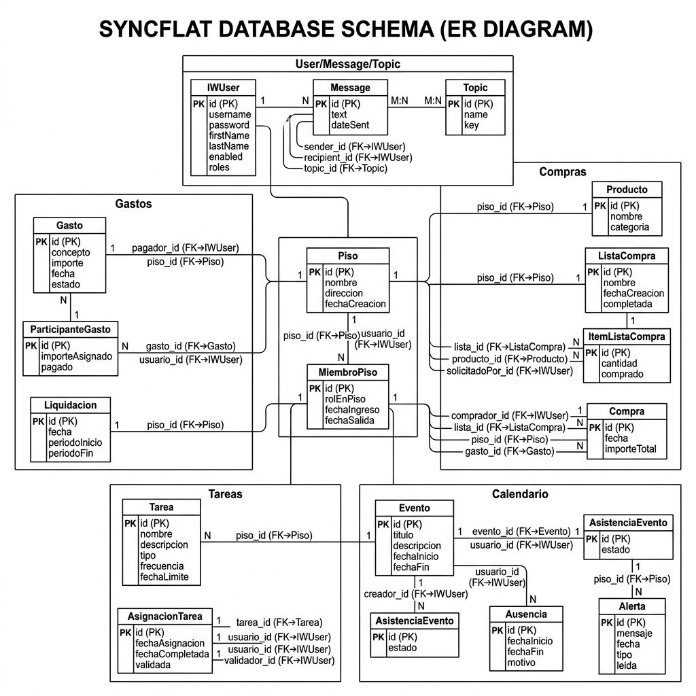

# SyncFlat — Gestión integral para pisos compartidos

## ¿Qué es SyncFlat?

SyncFlat es una aplicación web orientada a personas que **comparten piso** y necesitan coordinar de forma clara y justa el dinero, la organización doméstica y el tiempo. El sistema se estructura en módulos independientes pero conectados entre sí.

## Funcionalidades actuales (entrega)

- **Página de inicio** (`/`): presentación del proyecto y enlaces a los módulos.
- **Módulo de Gastos** (`/modulos/gastos`): descripción de la funcionalidad de control de gastos compartidos.
- **Módulo de Compra** (`/modulos/compra`): organización de compras y reparto flexible.
- **Módulo Home** (`/modulos/home`): panel de control centralizado del piso.
- **Módulo de Tareas** (`/modulos/tareas`): gestión de tareas domésticas con **demo JavaScript interactiva** (botón que añade ítems a una lista sin backend).
- **Módulo de Calendario** (`/modulos/calendario`): planificación y disponibilidad compartida.
- **Autores** (`/autores`): información sobre el autor del proyecto.
- **Login y seguridad**: autenticación con formulario; botones de debug para login rápido (usuarios A y B).
- **Administración** (`/admin/`): visible solo para usuarios con rol ADMIN.

## Cómo ejecutar

### Requisitos
- **Java 21** (JDK)
- **Maven 3.8+** (o usar el wrapper `mvnw` si está disponible)

### Comandos

```bash
# Desde la raíz del repositorio
mvn spring-boot:run
```

La aplicación se inicia en **http://localhost:8080**.

## Estructura del proyecto

```
├── pom.xml                          # Configuración Maven
├── README.md                        # Este fichero
├── src/
│   ├── main/
│   │   ├── java/es/ucm/fdi/iw/
│   │   │   ├── controller/
│   │   │   │   ├── RootController.java      # Endpoints principales
│   │   │   │   ├── AdminController.java     # Panel de administración
│   │   │   │   ├── UserController.java      # Gestión de usuarios
│   │   │   │   └── ApiController.java       # API REST
│   │   │   ├── model/                       # Entidades JPA
│   │   │   ├── SecurityConfig.java          # Configuración de seguridad
│   │   │   ├── LoginSuccessHandler.java     # Handler post-login
│   │   │   ├── StartupConfig.java           # Configuración inicial
│   │   │   └── IwApplication.java           # Punto de entrada
│   │   └── resources/
│   │       ├── application.properties       # Configuración de la app
│   │       ├── templates/
│   │       │   ├── fragments/               # Fragmentos Thymeleaf (head, nav, footer)
│   │       │   ├── index.html               # Página principal
│   │       │   ├── login.html               # Formulario de login
│   │       │   ├── gastos.html, compra.html, home.html, tareas.html, calendario.html
│   │       │   ├── autores.html             # Info del autor
│   │       │   └── admin.html, user.html, error.html
│   │       └── static/
│   │           ├── css/                     # Estilos (Bootstrap 5.3.3 + custom.css)
│   │           ├── js/                      # Scripts (Bootstrap, WebSocket, utilidades)
│   │           └── img/                     # Imágenes (logo, favicon, fotos)
│   └── test/                                # Tests (JUnit, Karate)
```

## Login y roles (debug)

La aplicación incluye **botones de login rápido** (visibles solo en modo debug):

| Botón | Usuario | Contraseña | Roles |
|-------|---------|------------|-------|
| **a** | `a` | `aa` | USER, ADMIN |
| **b** | `b` | `aa` | USER |

Estos botones aparecen en la esquina superior derecha de la barra de navegación cuando no hay sesión activa.

Tras hacer login, la navbar muestra los enlaces a todos los módulos. El enlace **Administrar** solo es visible para usuarios con rol ADMIN.

## Rutas y vistas

| Ruta | Vista | Acceso |
|------|-------|--------|
| `GET /` | index.html | Público |
| `GET /login` | login.html | Público |
| `GET /modulos/gastos` | gastos.html | Requiere login (USER) |
| `GET /modulos/compra` | compra.html | Requiere login (USER) |
| `GET /modulos/home` | home.html | Requiere login (USER) |
| `GET /modulos/tareas` | tareas.html | Requiere login (USER) |
| `GET /modulos/calendario` | calendario.html | Requiere login (USER) |
| `GET /autores` | autores.html | Requiere login (USER) |
| `GET /admin/` | admin.html | Requiere ADMIN |
| `GET /user/{id}` | user.html | Requiere login (USER) |

## Estructura de la base de datos

El modelo relacional consta de **15 entidades JPA** y **5 enumerados**, organizados en torno a la entidad central `Piso`. Las entidades heredadas de la plantilla (`User`, `Message`, `Topic`) usan `GenerationType.SEQUENCE`; las nuevas usan `GenerationType.IDENTITY`.



Enumerados: `EstadoGasto`, `EstadoAsistencia`, `RolPiso`, `TipoAlerta`, `TipoTarea`.

## Estado de implementación por vista

| Vista | Ruta | Estado | Detalle |
|-------|------|--------|---------|
| **index** | `GET /` | ✅ Completa | Página principal con descripción del proyecto y enlaces a los módulos |
| **login** | `GET /login` | ✅ Completa | Formulario de login con CSRF; botones de debug para login rápido |
| **gastos** | `GET /modulos/gastos` | 📝 Descriptiva | Muestra funcionalidades previstas (registro, reparto, balance, liquidación) |
| **compra** | `GET /modulos/compra` | 📝 Descriptiva | Describe catálogo compartido, listas, reparto de gasto |
| **home** | `GET /modulos/home` | 📝 Descriptiva | Panel de control: resumen, eventos, alertas, ausencias |
| **tareas** | `GET /modulos/tareas` | 🟡 Parcial | Descripción + **demo JavaScript interactiva** que añade tareas dinámicamente |
| **calendario** | `GET /modulos/calendario` | 📝 Descriptiva | Vistas por horas, por integrante, conflictos y sugerencias |
| **autores** | `GET /autores` | ✅ Completa | Foto y nombre del autor |
| **admin** | `GET /admin/` | ✅ Completa | CRUD de usuarios (habilitar/deshabilitar), tabla con DataTables, mensajes vía AJAX |
| **user** | `GET /user/{id}` | ✅ Completa | Perfil de usuario con AJAX, WebSocket para mensajería en tiempo real |

Las vistas de módulos (gastos, compra, home, calendario) son actualmente **descriptivas**: muestran las funcionalidades previstas pero no tienen aún funcionalidad con backend. Las entidades JPA correspondientes ya están definidas y pobladas en `import.sql`, por lo que la conexión entre vista y modelo de datos es directa.

## Relación con la prueba externa

La prueba Karate (`src/test/java/es/ucm/fdi/iw/prueba.feature`) cubre **8 escenarios** que ejercitan las vistas y funcionalidades principales:

| Escenario | Vista/funcionalidad probada |
|-----------|---------------------------|
| 1 — capturar CSRF | `login` (seguridad) |
| 2 — login correcto | `login` → `index` |
| 3 — ver resumen del piso | `home` (contenido descriptivo) |
| 4 — ver gastos compartidos | `gastos` |
| 5 — ver lista de la compra | `compra` |
| 6 — ver tareas | `tareas` |
| 7 — admin accede a administración | `admin` (control de acceso por rol ADMIN) |
| 8 — usuario normal no accede | `admin` (denegación por rol USER) |

Los escenarios 7 y 8 validan específicamente la **seguridad por roles**: el usuario `a` (ADMIN) puede acceder y el usuario `b` (USER) recibe un 403.

## Despliegue

El proyecto incluye herramientas de despliegue automatizado:

- `deploy.py`: script Python que empaqueta el JAR, sube ficheros de BD/datos y despliega en un contenedor Docker de la FDI vía SSH
- `application-container.properties`: perfil Spring Boot para producción (puerto 80, H2 a fichero, caché activa, debug desactivado)
- `credentials.json.template`: plantilla de credenciales (no se sube al repositorio)

Para desplegar:
```bash
python deploy.py
```

## Notas sobre carpetas adicionales

Las carpetas `demo/`, `jpademo/`, `qna/` y `plantilla/` provienen del repositorio original de la asignatura y contienen material de referencia del profesorado. No forman parte del proyecto SyncFlat y pueden ignorarse durante la evaluación.

## Notas de escalabilidad

### Arquitectura propuesta para crecer

```
controller/     → Recibe peticiones HTTP, delega en servicios
service/        → Lógica de negocio (a crear cuando se implementen funcionalidades reales)
repository/     → Acceso a datos JPA (Spring Data)
model/          → Entidades de dominio
dto/            → Objetos de transferencia (a crear)
```

### Módulos futuros (roadmap)

1. **Persistencia de gastos**: entidad `Gasto` con JPA, CRUD completo, reparto automático.
2. **Lista de la compra**: entidad `ItemCompra`, listas compartidas en tiempo real (WebSocket).
3. **Tareas con rotación**: entidad `Tarea`, asignación automática por turnos, historial.
4. **Calendario compartido**: entidad `Evento`, vistas por semana/mes, detección de conflictos.
5. **Notificaciones**: sistema de avisos push vía WebSocket (ya preparado en la plantilla).

### Consideraciones de seguridad

- Validación de entrada en todos los formularios (Bean Validation / `@Valid`).
- CSRF habilitado (excepto API REST).
- Autorización por roles (`@Secured`, `@PreAuthorize`).
- Sanitización de datos para evitar XSS.

### Separación de responsabilidades

- **Templates**: solo presentación, usando fragmentos reutilizables (`head`, `nav`, `footer`).
- **Controllers**: delegar siempre en servicios, no contener lógica de negocio.
- **Servicios**: encapsular lógica, transacciones y validaciones.
- **Repositorios**: solo acceso a datos, sin lógica.